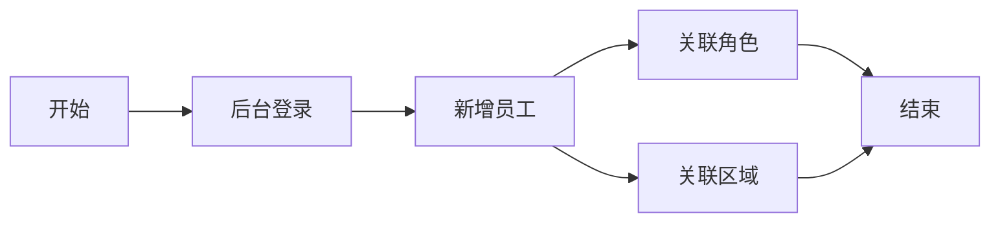

# 项目实战

meefood(我食)是一个基于物联网概念下的智能收货运营管理系统


## 角色与功能

* 管理员：查看订单，统计报表
* 运维人员：投放设备，拆除设备，维修设备
* 运营人员：补货
* 合作商：提供点位，坐收渔翁之利
* 消费者：在小程序下单商品

## 库表设计


## 初识AI

### AIGC

* AI Generated Content：AI领域的一个应用分支，专注于AI技术自动生成内容

### 提示工程

* 提示就是我们对大模型提问的问题
* 提示工程也称为上下文提示，设计优化和输入文本来引导AI模型生成预期的输出

#### promt的组成

* 角色
* 指示
* 上下文
* 例子
* 输入
* 输出

## 点位管理

### 需求说明

* 业务场景：在成都的高流量商业区和居民区与潜在合作商洽谈，确定定位不熟智能售货机，提供便捷的购买服务
* 点位管理功能主要涉及三个模块


### 表设计

* 区域表：主键id，区域名称、~~备注说明~~
* 合作商表：主键id、合作商名称、联系人、联系电话、分成比例、账号、密码
* 点位表：主键id、点位名称、区域外键、商圈字典、合作商外键、详细地址


* 关系字段：`region_id`、`partner_id`
* 数据字典：`bussiness_type`

### 生成基础代码

* 创建目录菜单
* 添加数据字典
* 配置代码生成信息
* 下载代码，并导入项目

### 区域管理代码改造

* 查看详情，显示当前区域下所有的点位列表
* 查询区域列表的时候，同时显示每个区域的点位数

**解决方案**

① 同步存储：在区域表中有点位字段，点位发生变化时，同步区域的点位数

② **关联查询**：编写关联查询语句，在mapper层封装

**实现步骤**

* 关联查询编写sql语句
* 创建`ReagionVO`增加关键字段`nodeCount`
* 在`RegionMapper`和`xml`文件中添加查询`Vo`方法和sql
* 在`RegionService`接口和实现类中添加查询Vo方法
* 修改`RegionCountroller`查询方法
* 修改前端页面视图

### 合作商管理改造

#### 改造需求

* 查看详情，需要显示合作商名称、联系人、联系电话、分成比例
* 查询合作商的时候，显示每个合作商的点位数
* 重置密码，初始密码为123456

**重置密码流程**


### 点位改造

#### 改造需求

* 查看详情，显示当前点位下所有的设备列表
* 区域详情中，显示每个点位的设备数
* 在点位列表查询中，关联显示区域，合作商信息

#### **实现思路**

* **关联查询**：对于设备数量的统计，执行关联查询，在mapper层封装
* **关联实体**：对于区域合作商的数据，采用Mybatis提供的嵌套查询功能

```xml
<association>单个结果</association>
<collection>多个结果集</collection>
```

## 全局异常处理

* `SQLIntegrityConstraintViolationException`：通常表示SQL数据库操作中的完整性约束违反异常：例如外键约束、唯一约束
* `DataIntegrityViolationException`：如果违反了数据完整性则会抛出这个异常

## 人员管理

### 需求说明

* 点位管理之后，需要安排工作人员
* 人员管理模块业务流程如下：



### 库表设计

人员管理模型示意图：

* 关系字段：`role_id`, `region_id`
* 数据字典：`status`（1启用，0停用）
* 冗余字段：`region_name`, `role_code`, `role_name`


### 生成基础代码

* 创建目录菜单
* 添加数据字典
* 配置代码生成信息
* 下载代码并导入项目

### 属性一致性

冗余字段的值如何和主表进行同步更新？

**同步存储功能**：在更新主表的时候，同时更新员工表中的区域名称

* 编写SQL根据ID修改区域名称
* `EmpMapper`中添加方法
* 在`RegionServiceIMp`进行逻辑调整，并添加事务

## 文件存储

若依框架将图片存储在服务器本地的目录。

使用XfileStorage插件来对文件进行存储。

## 设备管理

### 需求说明

* 管理员在系统中录入设备信息之后，员工负责设备的投放和商品补货功能
* 具体的业务流程如图：


### 库表设计

* 数据字典：`vm_status`（0未投放、1运营、2撤机）
* 冗余字段：`addr`, `bussiness_type`, `region_id`, `partner_id`


### 生成基础代码

* 创建目录菜单
* 添加数据字典
* 配置代码生成信息
* 下载代码并导入到项目

### 设备类型管理

* 搜索功能
* 列表展示前端
* 添加和修改框的操作

### 设备管理改造

* 新增设备时，补充设备表其他字段，还要售货机类型创建所属货道

* 修改设备时，根据点位同步更新冗余字段信息

### 设备状态管理


# BUG处理

## 1.MySQL执行出现错误

```sql
<select id="selectRegionVoList" resultType="com.dkd.manage.domain.vo.RegionVo">
       select r.*, count(n.id) as node_count from tb_region r left join tb_node n on r.id = n.region_id
        <where>
            <if test="name != null  and name != ''"> and r.name like concat('%', #{name}, '%')</if>
        </where>
        group by r.id
</select>
```

`group by r.id`要放在`where`子句的后面，要严格按照语法顺序编写 sql

## 2.建表语句出现错误

```sql
COLLATE=utf8mb4_0900_ai_ci
-- collate关键字表示字段的排序准则
-- mysql5.7 utf8mb4使用的默认排序准则是utf8mb4_general_ci
-- mysql8 utf8mb4使用的默认排序准则是utf8mb4_0900_ai_ci
```

## 3.IDEA启动项目出现找不到包的错误

* IDEA清除本地缓存
* MVN重新刷新项目

## 4 长文本信息列表展示换行问题

```vue
元素中加入这个标签：show-overflow-tooltip="true"
```

